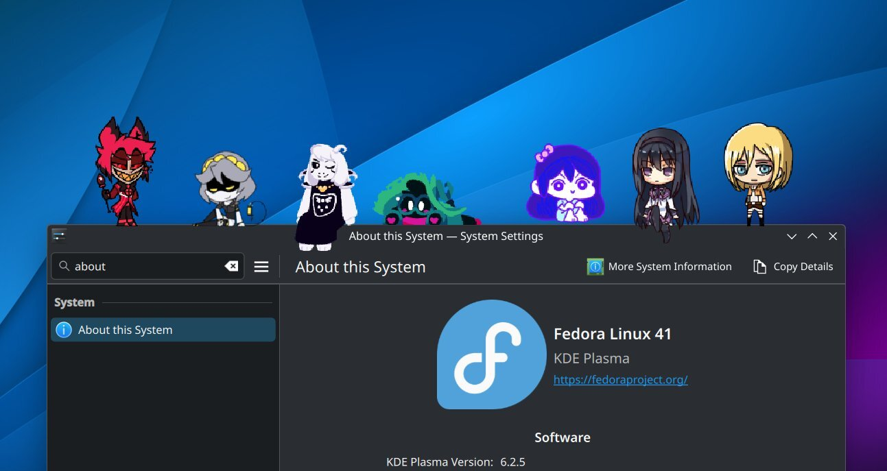

# Shijima-Qt

> [!IMPORTANT]
> Shijima-Qt was discontinued and archived due to lack of maintenance and the project's current state. The latest recommended/stable build has been v0.1.0 for over a year now and it is missing important fixes and improvements from libshijima/libshimejifinder. Furthermore, the feature/wayland-layer-shell branch has deviated so much from the main branch that it has become very hard to merge back. I now believe that Qt was not the right framework for this project, and the amount of hacks I had to use to make it work with Qt has turned this project into an unmanageable mess. Therefore, I don't think it's a good idea to continue working on this project further. I may work on a new, more optimized desktop version of Shijima that does not use Qt in the future. In the meantime, please check out the other, more current versions of Shijima: [Shijima-iOS](https://havoc.app/package/shijima), [Shijima-Android](https://play.google.com/store/apps/details?id=com.pixelomer.shijima), [Shijima-Web](https://pixelomer.github.io/Shijima-Web/)



Cross-platform shimeji desktop pet simulator. Built with Qt6. Supports macOS, Linux and Windows.

- [Download the latest release](https://github.com/pixelomer/Shijima-Qt/releases/latest)
- [See all releases](https://github.com/pixelomer/Shijima-Qt/releases)
- [Report a bug or make a feature request](https://github.com/pixelomer/Shijima-Qt/issues)
- [Shijima homepage](https://getshijima.app)

If you'd like to support the development of Shijima, consider becoming a [sponsor on GitHub](https://github.com/sponsors/pixelomer) or [buy me a coffee](https://buymeacoffee.com/pixelomer).

## Building

If you have any problems with building Shijima-Qt, see the GitHub workflows in this repository.

### macOS

1. Install MacPorts.
2. Install build dependencies.

```bash
sudo port install qt6-qtbase qt6-qtmultimedia pkgconfig libarchive
```

3. Build.

```bash
CONFIG=release make -j8
```

### Linux

```bash
CONFIG=release make -j8
```

### Windows

A Docker image is provided to build Shijima-Qt.

```bash
docker build -t shijima-qt-dev docker-dev
docker run -e CONFIG=release --rm -v "$(pwd)":/work shijima-qt-dev bash -c 'mingw64-make -j8'
```

## Platform Notes

### macOS

Shijima-Qt needs the Accessibility permission to access the frontmost window.

### Linux

Shijima-Qt supports KDE Plasma 6 and GNOME 46 in both Wayland and X11. To get the frontmost window, Shijima-Qt automatically installs and enables a shell plugin when started.  
- On KDE, this is transparent to the user.
- On GNOME, the shell needs to be restarted on the first run. This can be done by logging out and logging back in. Shijima-Qt will exit with an appropriate error message if this is required.
- On other desktop environments, window tracking will not be available.

### Windows

Only tested on Windows 11. May also work on Windows 10. Window tracking is supported and no extra actions should be necessary to run Shijima-Qt.
